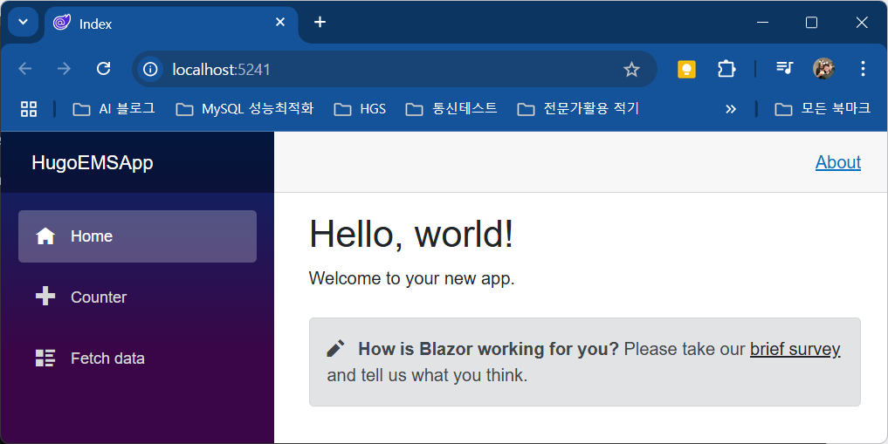

## ASP.NET 레퍼런스

### ASP.NET Core + Flask AI

### ASP.NET Core blazor App
1. Blazor Server App 선택(Blazor는 현재 .NET 8.0 까지는 지원하지 않음)
2. 빌드 후 실행

    

3. MVC 모델이 아님
4. 전체 구조
    - Properties > launchSettings.json : 동일 기능
    - wwwroot : 동일 기능
    - Dependency : 동일 기능
    - Data : MVC의 모델과 서비스 
    - Pages : 각 페이지의 cshtml과 razor 파일 구성
    - Shared : 전체 레이아웃, 메뉴로 표현됨
    - _Imports.razor : Razor 컴포넌트들에 **공통 지시문(directives)**을 적용하는 역할을 하는 선언용 파일
    - App.razor : Blazor 애플리케이션의 진입점(entry point) 역할을 하는 특별한 Razor 컴포넌트
    - appsettings.json : 애플리케이션의 설정 정보를 저장하는 구성(Configuration) 파일. DB연결 문자열 등
    - Program.cs : **ASP.NET Core 애플리케이션의 진입점(Main Entry Point)**이자 호스트(Host)를 구성하고 실행하는 핵심 파일

5. Index.razor, @page 디렉티브 외 삭제
6. FetchData.razor, Counter.razor 파일 삭제
7. NavMenu.razor에서 위 관련메뉴 삭제
8. Data 폴더내 파일 모두 삭제
9. MainLayout.razor About 관련 링크 삭제
10. Program.cs 의 WeatherForecastService 관련 부분 삭제

11. App.razor에 전체 바깥에 CascadingAuthenticationState 태그 추가

    ```html
    <CascadingAuthenticationState>
        <Router AppAssembly="@typeof(App).Assembly">
            <Found Context="routeData">
                <RouteView RouteData="@routeData" DefaultLayout="@typeof(MainLayout)" />
                <FocusOnNavigate RouteData="@routeData" Selector="h1" />
            </Found>
            <NotFound>
                <PageTitle>Not found</PageTitle>
                <LayoutView Layout="@typeof(MainLayout)">
                    <p role="alert">Sorry, there's nothing at this address.</p>
                </LayoutView>
            </NotFound>
        </Router>
    </CascadingAuthenticationState>
    ```

12. MainLayout.razor에 AuthorizeView 태그 추가, 변경

    ```html
    <div class="page">
        <div class="sidebar">
            <NavMenu />
        </div>
        <AuthorizeView>
            <Authorized>
                <main>
                    <article class="content px-4">
                        @Body
                    </article>
                </main>
            </Authorized>
            <NotAuthorized>
                <h2>Not Authorized</h2>
            </NotAuthorized>
        </AuthorizeView>
    </div>
    ```

13. NuGet 패키지 라이브러리 설치
    - Bogus
    - Pomelo.EntityFrameworkCore.MySql 버전 7.0으로 변경 설치
    - Microsoft.AspNetCore.Identity
14. Areas > Identity > Pages > Account 폴더 생성
15. Pages에 _IdentityLayout.cshtml 생성
16. https://www.youtube.com/watch?v=SZb1O_3wPT0&list=PL4G0MUH8YWiBfAKogbkWcnTBGI1W0HIc3&index=2 4:50 초에서 계속
